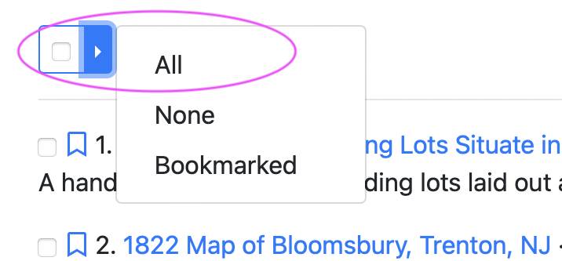
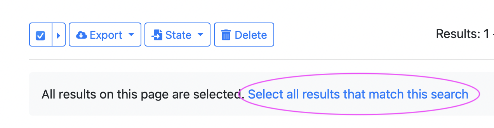

## About

**What is it?**

: [GEOMG](https://github.com/geobtaa/geomg) is a custom tool that functions as a backend metadata editor and manager for the GeoBlacklight application. 

**Who uses it?**

: BTAA-GIN [Operations technical staff](https://sites.google.com/umn.edu/btaa-gdp/about/community#h.gtto9fewuh3z) at the University of Minnesota

**Who developed it?**

: The BTAA Geoportal Lead Developer, Eric Larson, created GEOMG, with direction from the BTAA-GIN. It is based upon the [Kithe framework.](https://github.com/sciencehistory/kithe)

**Can other GeoBlacklight projects adopt it?**

We are currently working on offering this tool as a plugin for GeoBlacklight.

In the meantime, this presentation describes the motivation for building the tool and a few screencasts showing how it works:

<iframe src="https://docs.google.com/presentation/d/e/2PACX-1vQAlzzbZxoS__W9ZoLQ1A3GbiwEE9lkvPzTw_VLrlY_7dkPrc8k5ApappPv35-1IjyIM1--Rh0UO28j/embed?start=false&loop=false&delayms=3000" frameborder="0" width="400" height="400" allowfullscreen="true" mozallowfullscreen="true" webkitallowfullscreen="true"></iframe>

----------------------

## Layout


### Dashboard (Home page)

The Dashboard shows a list of all records in the index. These can be selected or filtered. The search functionality mimics the GeoBlacklight interface:

* a search bar at the top for text searches
* a list of facets on the left to filter records
* a Date Range filter above the facets to select items by Date Created (when they were first added to GEOMG).


----------
### Form view

This page is where new records can be manually created and existing records can be edited.


!!! tip
	Click on the button "View in Geoportal" to open a new tab with the record in the Geoportal. Note: the record is still viewable in the Geoportal via this button, even if it is a Draft or Unpublished.

------------
### Notifications

Notifications is where the exported files can be found.


------------
### Admin Tools

The Admin Tools is a dropdown menu item that contains links to the various actions.


## Selecting records

Use the check boxes to select individual records or click the right arrow to select all records on the page.


To select all records in the list, first select all records on the page. Then, click the text, "Select all results that match this search."




## Adding new records
There are two ways to add new records to GEOMG: with the Form view or with a CSV upload.

### Form view
A user can create records one by one using the form view. 

1. Start on the main dashboard
2. click the button labeled **+New Document**
3. Manually type in values. Some fields need to be entered before the record can be saved including:
	* Title
	* Resource Class
	* ID
	* Access Rights


### Batch Uploading with a CSV

1. Save edited template to your desktop as a CSV file
[Use the B1G Template](https://z.umn.edu/b1g-template)

2. Upload the spreadsheet to GEOMG

	- Go to Admin Tools and select Imports. Click **New Import**.
	- Give a name to the upload and enter details about the source and description. These details are helpful later in tracking imports.
	- Select the CSV file for upload
	- For Type, choose **BTAA CSV**. 
	- Click the **Create Import** button
	- Review the _Field Mappings_ page. If the CSV was formatted with column headers spelled the same way as the template, the fields should automatically map to the correct elements. Otherwise, manually choose the crosswalk mapping.
	- Scroll to the bottom and click the button **Create Mapping**
	- On the _Import_ page, check that the number in the CSV Row Count matches your CSV.
	- Click the button **Run Import**
	- The import may take a few minutes. During the process, you can view the Import Results tab. Items in the queue will show up in the first sub-tab ("Failed"), but will transfer to the second tab upon import ("Success").
	- When complete, review and troubleshoot any items that did not import in the Failed tab.

3. Spot check records for errors and consistency

	- The newly uploaded records will be listed as **Draft** under the Publication State on the main dashboard
	- Select 'Draft' under Publication State and select an item. This will open it in editing view.
	- Click the button **View in Geoportal**
	- Inspect the record and test the links.	- Repeat this process for about 3 records.


4. Convert records from 'Draft' to 'Published'

	- If the records are satisfactory, return to the Dashboard view and select all Draft items in the upload. 
	- Select All and then select the text "Select all results that match this search"
	- Click the State button. From the dropdown, select Published.
	- On the _Bulk Action_ page, click the button **Run Bulk Action**
	- Review 3-5 of the published records and test all the links.

## Secondary tables

There are two metadata fields, `Multiple Download Links` and `Institutional Access Links` that use secondary tables. This occurs when the field needs parts to the value: a label + a link. 

* When using the Form view, these values can be entered directly.
* For CSV uploads, these values use a separate sheet than for the main import template.
* Multiple Download Links: 
	- on the Form view, scroll down to the Multiple Download Links inside the editor
	- to enter manually, click the New Download URL button
	- to upload multiple links, click the Import CSV button
* Institutional Access Links
	- on the Form view, click the text "Institutional Access Links" on the bottom of the right hand navigation OR go to Admin Tools - Access Links
	- to enter manually, click the New Access URL button
	- to upload multiple links, click the Import CSV button

!!! Info "CSV field headers for secondary tables"

    === "Multiple Downloads"

        ``` markdown
        
			| friendlier_id       | label            | value      |
			|---------------------|------------------|------------|
			| ID of target record |  any string      | the link   |
        ```

    === "Institutional Access Links"

        ``` markdown
			| friendlier_id       | institution_code | access_URL |
			|---------------------|------------------|------------|
			| ID of target record |  2 digit code    | the link   |
        ```


