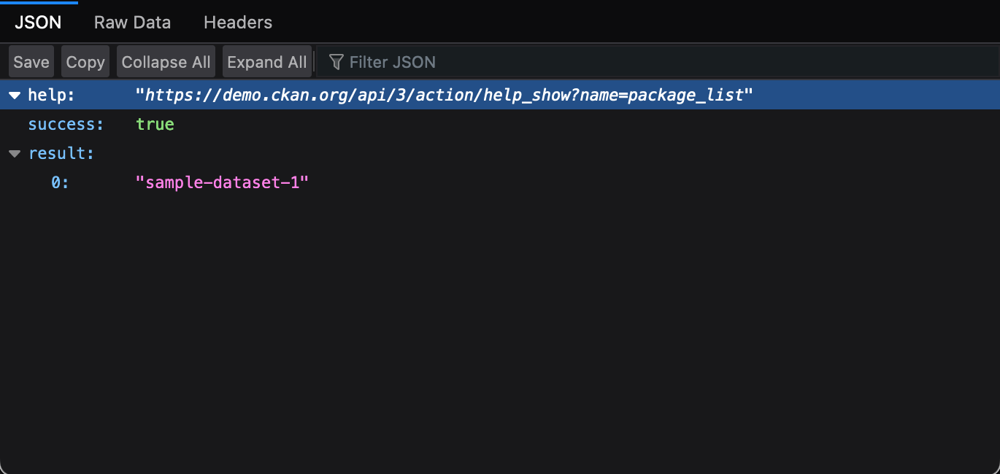

# CKAN Site Structure and Harvesting Sample Walkthrough Guide

- This guide will assist users in deconstructing the Comprehensive Knowledge Archive Network (CKAN) site structure and Application Programming Interface (API) design and how they are created through harvesting from selected portals.  

## CKAN Site Structure and API Breakdown

CKAN is a tool for making open data websites, it helps you manage and publish collections of data.  For CKAN purposes, data is published in units called “datasets”.

   - A dataset contains two things:

   > Information or “metadata” about the data. For example, the title and publisher, date, what formats it is available in, what license it is released under, etc.

   > A number of “resources”, which hold the data itself. CKAN does not mind what format the data is in. A resource can be a CSV or Excel spreadsheet, XML file, PDF document, image file, linked data in RDF format, etc. CKAN can store the resource internally, or store it simply as a link, the resource itself being elsewhere on the web. A dataset can contain any number of resources. For example, different resources might contain the data for different years, or they might contain the same data in different formats.

This is the Raw site format breakdown for how data is compiled by web notation headers and other indicators in the BTAA format denoted by the harvest.py script for metadata purposes.

	

Only the site/portal would be harvested in this instance and the datastores/databases it contains.

!!! Note

	For CKAN it is a series of networks that interlink data units through JSON APIs similar to DCAT but are hosted on storage drives like databases and datastores.
