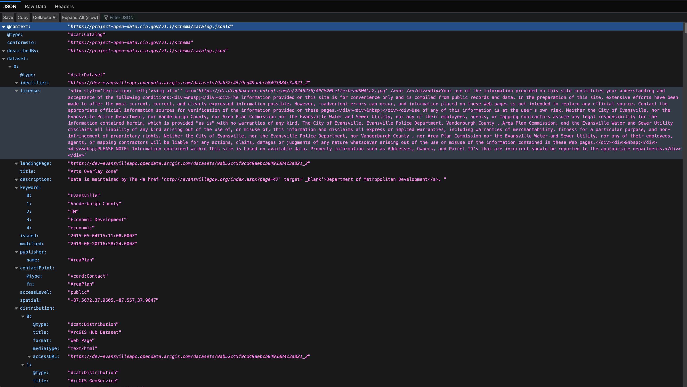

# DCAT JSON Structure

- This guide will assist users in deconstructing the Data Catalog Vocabulary in JavaScript Object Notation (DCAT JSON) file structure and Application Programming Interface (API) design and how they are created through harvesting from selected portals.  

## DCAT JSON File Structure and API Breakdown

- DCAT enables a publisher to describe datasets and data services in a catalog using a standard model and vocabulary that facilitates the consumption and aggregation of metadata from multiple catalogs. This can increase the discoverability of datasets and data services. It also makes it possible to have a decentralized approach to publishing data catalogs and makes federated search for datasets across catalogs in multiple sites possible using the same query mechanism and structure. Aggregated DCAT metadata can serve as a manifest file as part of the digital preservation process.

This is the Raw JSON Data dictionary format breakdown for how data is compiled by web notation headers and other indicators in the BTAA format denoted by the harvest.py script for metadata purposes.

This is the regular JSON compiled format for arrangement of web syntax in JavaScript and displayed in arrangement of specific headers in BTAA format denoted by the harvest.py script for metadata purposes.

