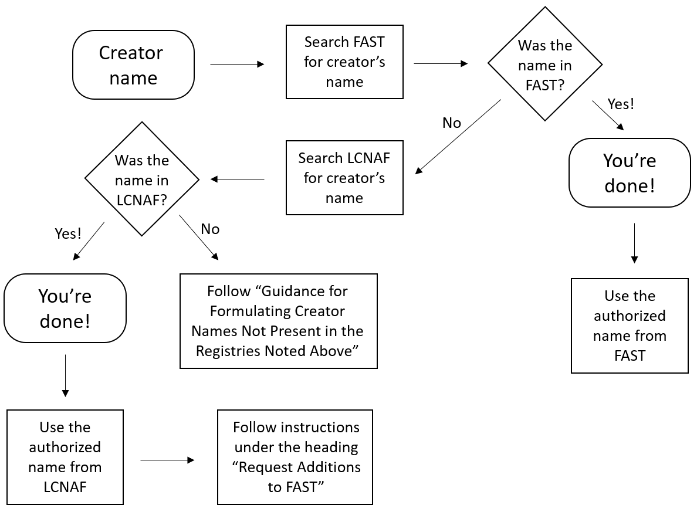

# Best Practices for Standardizing Creator Field Data

:fontawesome-solid-user: Authors: Creator Standardization Working Group

Date: 28 November 2022

!!! info

	See this Journal Article for a more thorough description of this process:
	
	Laura Kane McElfresh (2023) Creator Name Standardization Using Faceted Vocabularies in the BTAA Geoportal, Cataloging & Classification Quarterly, DOI: 10.1080/01639374.2023.2200430

Creator names are a critical access point for the discovery of geospatial information. Within the [BTAA Geoportal](https://geo.btaa.org/), creator names–whether names of persons or corporate bodies–are displayed on landing pages and the citation widget, and are indexed and faceted for searching and browsing. Standardizing the names of resource creators makes search results more predictable, thereby producing a better experience for Geoportal users.

To ensure that the Geoportal’s collocation functions operate properly, this document recommends using the formulation of personal and corporate body names as they are found in identity registries and, when creators are not available in those registries, provides guidance for formulating names of creators. We seek to provide consistency of creator names within our database through the recommendations provided below. This document does not address the manual creation or editing of identity registry records.

These best practices assume that standardization of names will occur after data is ingested into the BTAA Geoportal; however this document may be used to inform description choices made before records are ingested into the Geoportal.


## Preferred Identity Registries

These best practices recommend consulting one or two name registries when deciding how to standardize names of creators: the Faceted Application of Subject Terminology (FAST) or the Library of Congress Name Authority File (LCNAF). FAST is a controlled vocabulary based on the Library of Congress Subject Headings (LCSH) that is well-suited to the faceted navigation of the Geoportal. The LCNAF is an authoritative list of names, events, geographic locations and organizations used by libraries and other organizations to collocate authorized creator names to make searching and browsing easier.


## Overview of the Process

These best practices present the following workflow for standardizing names of creators:

### Search FAST for the creator’s name
* If the creator’s name is found, then use the name as found in FAST
* If there’s no match in FAST, then consult the Guidance for Formulating Creator Names Not Present in the Registries Noted Above




### Searching FAST

To search the FAST registry for a creator name, you may use either [assignFAST](http://experimental.worldcat.org/fast/assignfast/) or [searchFAST](https://fast.oclc.org/searchfast/). assignFAST is ideal for quick searches, while searchFAST allows for advanced searching.

#### assignFAST
* Go to [http://experimental.worldcat.org/fast/assignfast/](http://experimental.worldcat.org/fast/assignfast/) and begin typing the creator name into the text box.
* assignFAST will suggest headings in FAST format. When the correct heading appears, click it in the list of suggestions. 
* The selected heading will appear in the text box, highlighted for copying.
    * For example, if you type in `St. Francis, Minnesota`, you will see suggestions including 
        * “Minnesota--St. Francis (Anoka County) _USE_ **Minnesota--Saint Francis (Anoka County)**”
        * “Minnesota--St. Francis (Anoka Co.) _USE_ **Minnesota--Saint Francis (Anoka County)**”.
    * Click on either of those suggestions and you will receive the authorized form of the name: `Minnesota--Saint Francis (Anoka County)`.
* Copy the authorized name from the text box and paste it into the spreadsheet.


### Searching LCNAF

When a name is **not** found in FAST, search the [Library of Congress Name Authority File (LCNAF)](https://id.loc.gov/authorities/names.html) for a match using the directions found in the Searching LCNAF section below. 

If no match is found, there’s no requirement to do intensive research. Continue to the next section, Guidance for Formulating Creator Names Not Present in the Registries Noted Above. If using these Best Practices in a metadata sprint, you may alternatively move onto the next name in the sprint spreadsheet.

## Guidance for Formulating Creator Names Not Present in the Registries Noted Above

When a personal or corporate body name cannot be found in neither FAST nor LCNAF, follow the directions below.


### Personal Names

Personal names should be formulated in inverted order (last name first) based on the information that appears on the item in the Geoportal.

```
    Felsted, L. E.
    Ackley, Seth
    Colvert, DeLynn C.
    Griffey, Ken, Jr. 
```

In cases where extra information is needed to distinguish a name, you may add a parenthetical at the end of the name, e.g., Surveyor, Cartographer, Draftsman, Geologist, Engraver. 


```
Perry, Katy (Cartographer)
```

### Corporate Body Names

#### Abbreviations and Initialisms

Regardless of how a name appears on the resource, always use the spelled out form of the name as opposed to abbreviations or initialisms for the purpose of being clear. For example, use 


:white_check_mark: United States Geological Survey

:x: U.S.G.S. 

:x: USGS

---------------------

:white_check_mark: Cook County Geographic Information Systems

:x: Cook County GIS

---------------------

#### Subordinate Bodies

A “subordinate body” is a corporate entity that is part of another corporate entity. To avoid confusion for Geoportal users, always include the name of the larger “parent” entity. For instance:


:white_check_mark: Cheyenne Light, Fuel and Power Company. Engineering Department

:x: Engineering Department

-----------------------

:white_check_mark: Canada. Department of the Interior

:x: Department of the Interior

---------------------


#### Jurisdictional Geographic Names Used in the Creator Field

For background, “jurisdictional” place names are those that are defined legally by a set of boundaries and overseen by a governmental agency. In the United States these would be cities, towns, townships, boroughs, villages (mostly), counties, states and so forth. Non-jurisdictional places are of two types: either entities in nature that have been given a name such as the Mississippi River or Rocky Mountains, or are administrative component areas of a larger formal jurisdiction such as ranger districts within a national forest.

It will be extremely rare NOT to find an authorized form of a jurisdictional place name in FAST and LCNAF. However, if you encounter a place not found in these resources, follow the pattern used in FAST.

For a dataset in which the creator name is given as “City of Kenosha”, FAST formulates the jurisdictional place name as:


```
    Wisconsin--Kenosha
```


## Directions for standardizing metadata records for the BTAA Geoportal

When a name is not found in FAST, search the [Library of Congress Name Authority File (LCNAF)](https://id.loc.gov/authorities/names.html) for a match following the directions in the Searching LCNAF section below. If a matching name is found in LCNAF, a FAST record may be requested, as explained below.

If no match is found, there’s no requirement to do intensive research. Instead, follow the direction in the section, Guidance for Formulating Creator Names Not Present in the Registries noted above.


### Searching LCNAF

To search the LCNAF for a creator name, you may use either the [Library of Congress Authorities](https://authorities.loc.gov/) or the [LC Linked Data Service](https://id.loc.gov/authorities/names.html). The LC Linked Data Service is ideal for quick keyword searches, while Library of Congress Authorities allows for browse searching.

Searching the LC Linked Data Service:

* Go to [https://id.loc.gov/authorities/names.html](https://id.loc.gov/authorities/names.html) 
* Type the creator name into the text box and press enter or click on Go
* The result that appears in the "Label" column is the LCNAF authorized form of the name, for instance, `Cumberland County (Pa.)`
* The number at the far right in the "Identifier" column is the Library of Congress control number (LCCN), which for Cumberland County Pennsylvania is `n81032665`

Often, when searching for names of persons, several results appear to be possible matches. In those cases, click on a heading in the results list and look for the "Sources" heading to see a list of citations that have been associated with that entity.

When a name is found in the LCNAF, submit a request that the LCNAF name be added to FAST by following the steps below.


### Request Additions to FAST

You will use the [importFAST Subject Headings](http://fast.oclc.org/importfast/) utility to request LCNAF additions to FAST.

1. First, select the type of LCNAF name.
    1. Personal Name
    2. Corporate Name
    3. Topical: We are unlikely to use this one for a creator.
2. Copy the “Identifier” (the Library of Congress control number) from the LCNAF record and paste it into the “enter name LCCN” text box. Click the “Import” button.
3. The form will automatically populate using the LCNAF name. Check to make sure the correct name has been imported.
4. Enter the email address `geoportal@btaa.org` (you do not need to fill out the “Anything extra” text box) and click “Submit Heading”.
5. The new FAST heading will appear! Please copy the FAST heading number from the end of the string (e.g. “`fst02013467`”) and paste it into the spreadsheet to show that the heading has been added to FAST.
6. Enter the newly created FAST heading into the spreadsheet.

Geographic names cannot be requested through the importFAST Subject Headings tool. In the spreadsheet, place “Yes” in the column labeled “Request FAST geographic name”.
